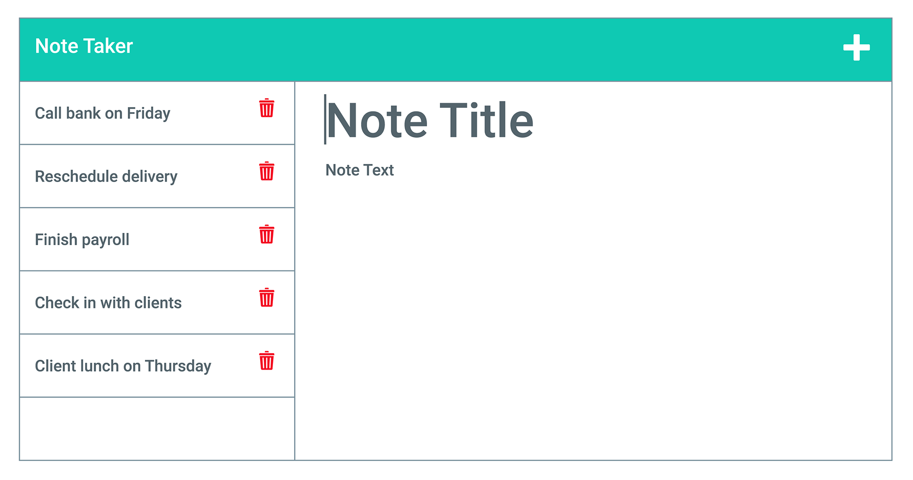

# Note Taker

## Description
A note-taking application that uses an Express.js backend to save and retrieve notes from a JSON file.

## Screenshots
 
(./images/11-express-homework-demo-02.png) 

## Installation
1. Clone the repository
2. Run `npm install`
3. Run `npm start`
4. Open `http://localhost:3000`

## Usage
- Click "Get Started" to view existing notes.
- Enter a title and text, then click the Save icon to add a new note.
- Click any existing note to view it.
- Click the trash icon to delete a note.

## API Routes
- `GET /api/notes` – returns all notes
- `POST /api/notes` – adds a new note (requires `title` and `text`)
- `DELETE /api/notes/:id` – deletes a note by id

## Technologies
- Node.js
- Express.js
- UUID package
- Bootstrap (front-end)

## Deployed Application
[Heroku Link]( https://express-11-notetaker-1c87524de417.herokuapp.com/...) 

## Repository
[GitHub Repo](https://github.com/jthapa1987/express.js-note-taker) 

## Author
Jeevan Thapa

## License
MIT
EOF
